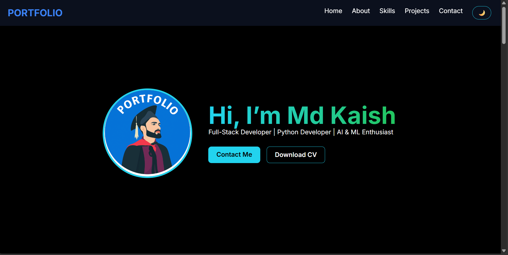
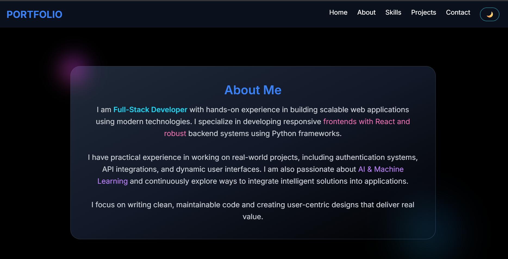
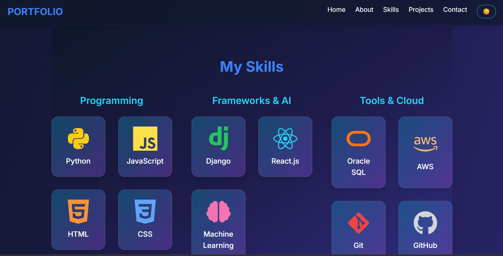
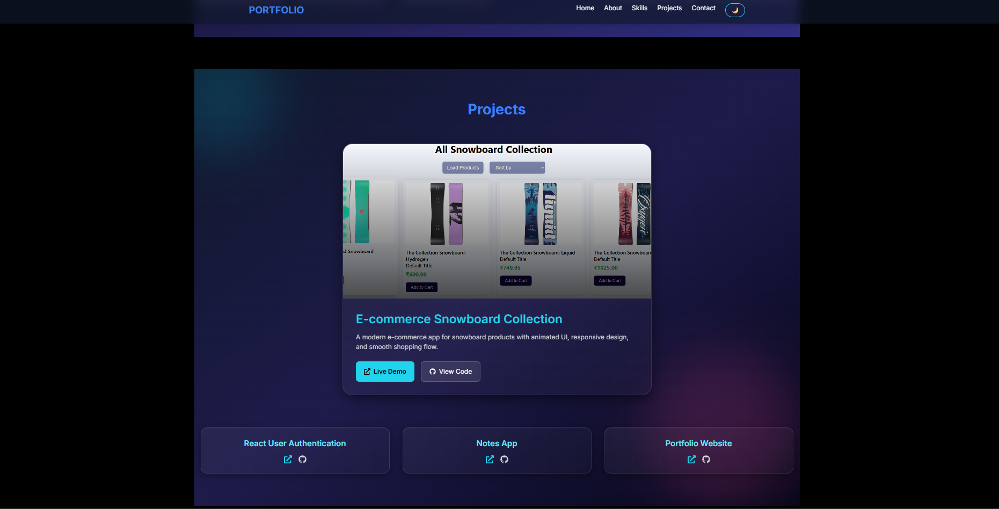
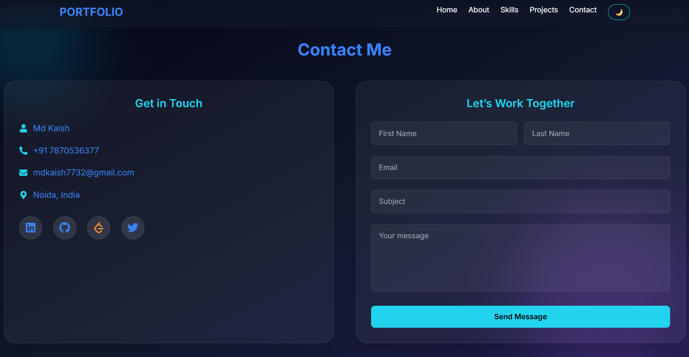

# 🚀 Personal Portfolio – Md Kaish

A modern, fully responsive **personal portfolio website** built using React.js and Tailwind CSS to showcase my skills, projects, and professional experience.

This project includes a **production-ready contact system** powered by EmailJS with auto-reply functionality, spam protection, and real-time notifications, ensuring a smooth and professional user experience.

Designed with a focus on **clean UI/UX, performance, and real-world usability** for recruiters, clients, and collaborations.

---

## ✨ Features

* 🎨 Responsive & modern UI design
* ⚡ Smooth animations using Framer Motion
* 📩 Contact form with EmailJS integration
* 🔁 Auto-reply email system for users
* 🔒 Spam protection (cooldown + request lock)
* 🔔 Toast notifications for success & errors
* 📄 Resume download with real-time feedback
* 🌙 Dark mode support
* 🔗 Social media integration (LinkedIn, GitHub, LeetCode)

---

## 📸 Screenshots

### 🏠 Hero Section



### 👨‍💻 About Section



### 🤹Skills Section



### 💼 Projects Section



### 📩 Contact Section



---

## 🛠️ Tech Stack

* React.js
* Tailwind CSS
* Framer Motion
* EmailJS
* React Hot Toast

---

## ⚙️ Installation

```bash
git clone https://github.com/your-username/your-repo-name.git
cd your-repo-name
npm install
npm run dev
```

---

## 🌐 Live Demo

👉 [https://your-portfolio-link.com](https://your-portfolio-link.com/)

---

## 📬 Contact

* 📧 Email: [mdkaish7732@gmail.com](mailto:mdkaish7732@gmail.com)
* 🔗 LinkedIn: [https://linkedin.com/in/md-kaish-3b7986211/](https://linkedin.com/in/md-kaish-3b7986211/)
* 💻 GitHub: [https://github.com/Mdkaish7732](https://github.com/Mdkaish7732)

---

## ⭐ Contribution

Feel free to fork this repository and customize it for your own portfolio.

---

## 📄 License

This project is open-source and available under the MIT License.
